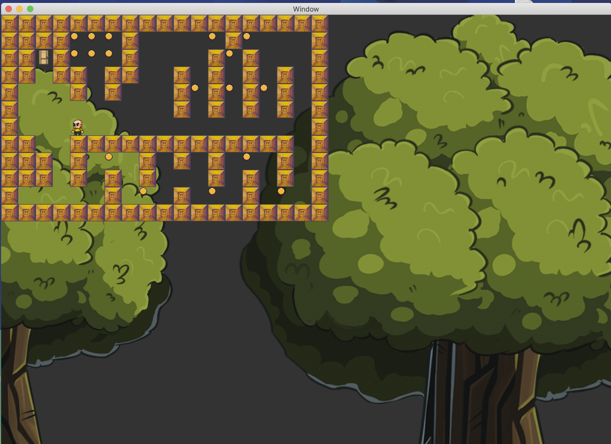

# so_long



A simple 2D game developed in C using MiniLibX, where the player's goal is to collect items and escape the map.

## Table of Contents
- [About the Project](#about-the-project)
- [Features](#features)
- [Objectives](#objectives)
- [Game Rules](#game-rules)
- [Map Requirements](#map-requirements)
- [Getting Started](#getting-started)
- [Controls](#controls)
- [Acknowledgments](#acknowledgments)

## About the Project
**so_long** is a small 2D game project intended to introduce graphics programming concepts. It is built with the MiniLibX library and focuses on window management, event handling, textures, and sprites.

The game's theme involves navigating a map, collecting items, and escaping through an exit. The project helps strengthen C programming skills, use basic algorithms, and practice memory management.

## Features
- 2D view with smooth window management.
- Collectibles and obstacles on the map.
- Movement tracking displayed in the terminal.
- Customizable maps using `.ber` files.

## Objectives
The project aims to:
- Implement a basic computer graphics program using MiniLibX.
- Develop a top-down or profile-view game.
- Strengthen understanding of window events and handling (e.g., closing the game window).

## Game Rules
- The player must collect all items (collectibles) to unlock the exit.
- The player can move using the arrow keys.
- The player cannot pass through walls.
- Movement is displayed as a count in the terminal.

## Map Requirements
- The map must contain:
  - `0` for open spaces
  - `1` for walls
  - `C` for collectibles
  - `E` for the exit
  - `P` for the player's start position
- The map must have at least one exit, one collectible, and a starting position.
- It must be surrounded by walls and have a valid path to all essential areas.

Example map:
```
1111111
1P0C0E1
1111111
```

## Getting Started
1. Clone the repository:

   git clone <repository-url>

2. Build the game using `make`. The MLX42 library will automatically download as a submodule.

3. Run the game with a `.ber` map file as an argument:

   ./so_long maps/example_map.ber

## Controls
- **Arrow Keys**: Move the player character
- **ESC**: Quit the game

## Acknowledgments
Special thanks to [GameDev Market](https://www.gamedevmarket.net/) for providing free game assets.

